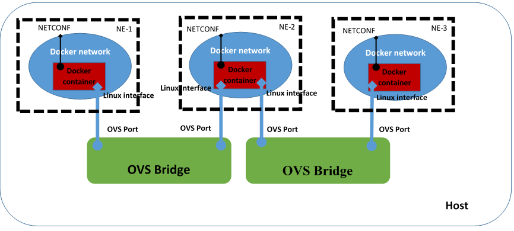

# OpenYuma-WE

OpenYuma Wireless Emulator is a wireless transport topology emulation with [OpenYuma](https://github.com/OpenClovis/OpenYuma) NETCONF server, 
based on [ONF TR-532](https://www.opennetworking.org/images/stories/downloads/sdn-resources/technical-reports/TR-532-Microwave-Information-Model-V1.pdf).

### Description

OpenYuma WE takes as input a JSON topology file, with a specific structure, describing the network 
to be emulated. Also, the second input file is the XML configuration file based on the YANG models 
to be used by each emulated Network Element.

Each NE is emulated as a docker container and exposes a NETCONF server based on the OpenYuma
framework, reflecting an information model based on TR-532 from ONF. All docker containers reside
on top of an [Open vSwitch](http://openvswitch.org/) bridge, and links between different NEs, as 
described in the JSON topology file, are emulated as connections through the OVS bridge. The 
high-level architecture of the emulator is shown below.



### Usage

The JSON topology configuration file `topology.json` for the topology in the previous figure 
looks like this:

```JSON
{
  "network-elements" : [
    {
      "network-element" :
      {
        "uuid" : "Simulator-1",
        "interfaces" : [
          {
            "layer" : "MWPS",
            "LTPs" : [{"id": "ifIndex1"}]
          },
          {
            "layer" : "MWS",
            "LTPs" : []
          },
          {
            "layer" : "ETH",
            "LTPs" : []
          }
        ]
      }
    },
    {
      "network-element" :
      {
        "uuid" : "Simulator-2",
        "interfaces" : [
          {
            "layer" : "MWPS",
            "LTPs" : [{"id": "ifIndex1"},{"id" : "ifIndex2"}]
          },
          {
            "layer" : "MWS",
            "LTPs" : []
          },
          {
            "layer" : "ETH",
            "LTPs" : []
          }
          ]
      }
    },
    {
      "network-element" :
      {
        "uuid" : "Simulator-3",
        "interfaces" : [
          {
            "layer" : "MWPS",
            "LTPs" : [{"id": "ifIndex1"}]
          },
          {
            "layer" : "MWS",
            "LTPs" : []
          },
          {
            "layer" : "ETH",
            "LTPs" : []
          }
          ]
      }
    }
    ],
  "topologies" : {
    "mwps" : {
      "links" : [
        [{"uuid" : "Simulator-1", "ltp" : "ifIndex1"}, {"uuid" : "Simulator-2", "ltp" : "ifIndex1"}],
        [{"uuid" : "Simulator-2", "ltp" : "ifIndex2"}, {"uuid" : "Simulator-3", "ltp" : "ifIndex1"}]
        ]
    },
    "mws" : {}
  },
  "controller" :
  {
    "ip-address" : "192.168.254.254",
    "port" : 8181,
    "username" : "admin",
    "password" : "admin"
  }
}
```

* Starting the emulator is done with the following command:

`sudo openyumawe --topo=topology.json --xml=<path_to_xml_file>`

* Stopping the emulator is done with the following command. This will delete 
all the previously created docker containers, docker networks or OVS Bridge or ports

`sudo openyumawe -c`

### Contact

alex.stancu@radio.pub.ro